# Obsidian配置
    该软件的下载和安装直接式安装即可，想要详细学习该软件的使用，网上有很多详细的介绍视频和文档，这里仅对与本项目相关设置进行说明。

## 1、主题选择

在 设置-外观-管理 下选择MInimal并且启用。
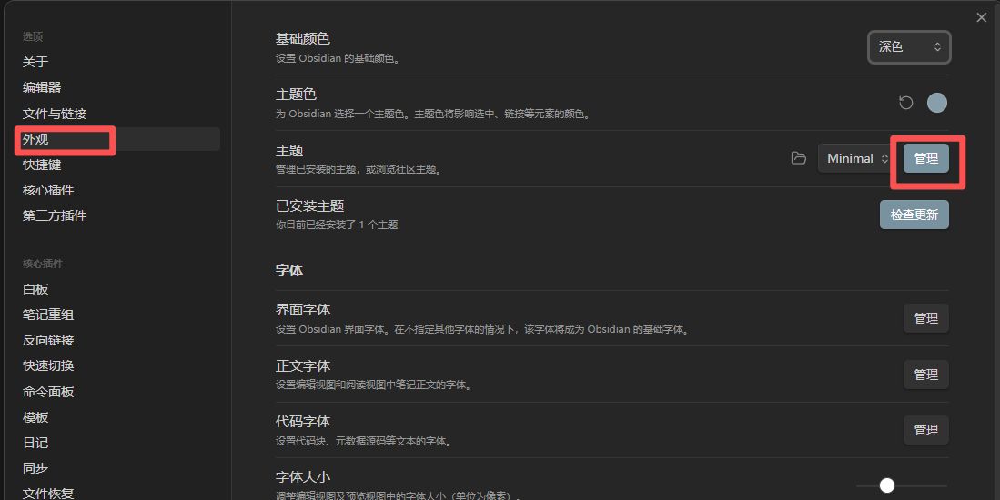
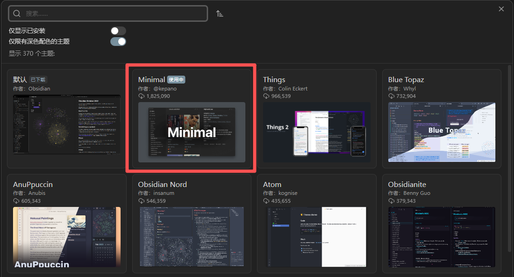

## 2、CSS配置

将项目的css文件夹下的文件复制到obsidian配置文件中

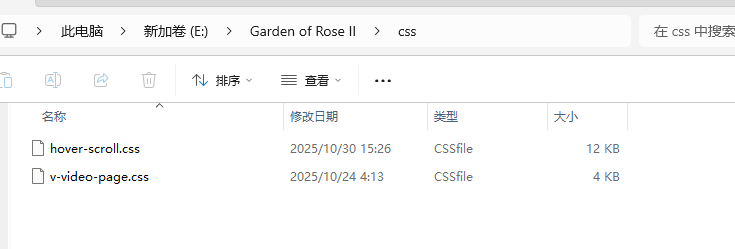
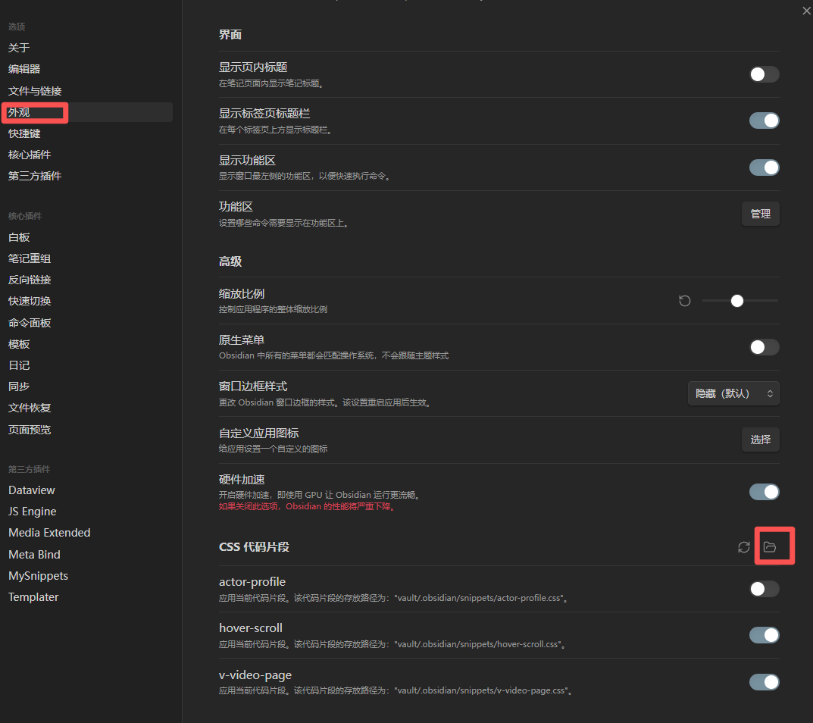
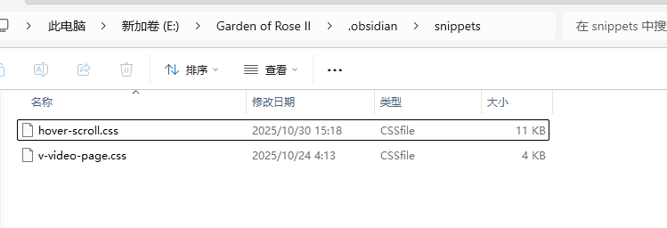

## 3、插件下载

下载如图所示的所需插件，首先关闭安全模式
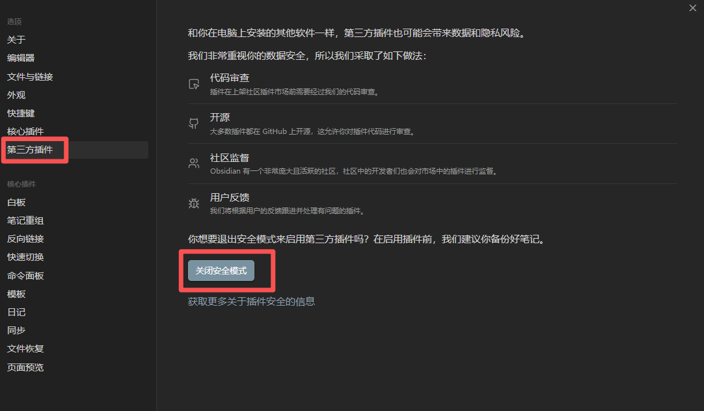
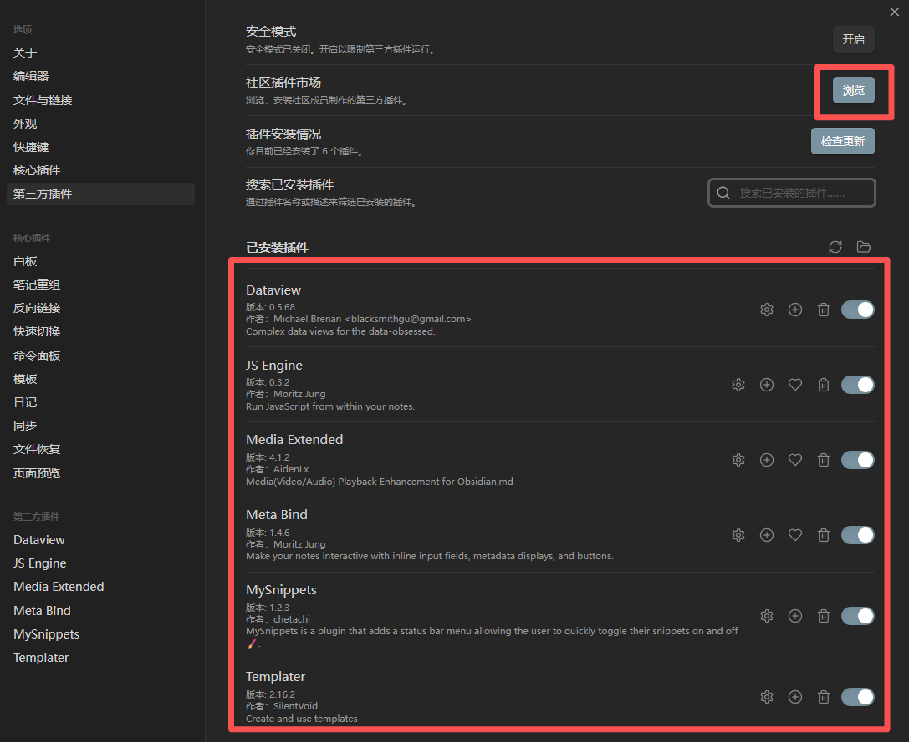

插件下载后都要启用，然后部分插件需要开启其中一些功能
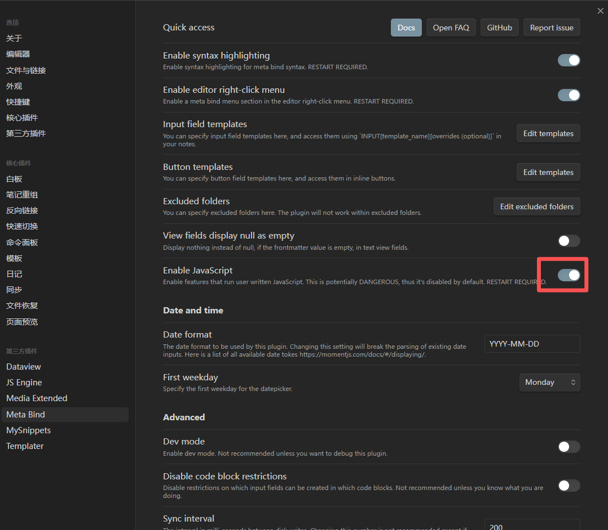
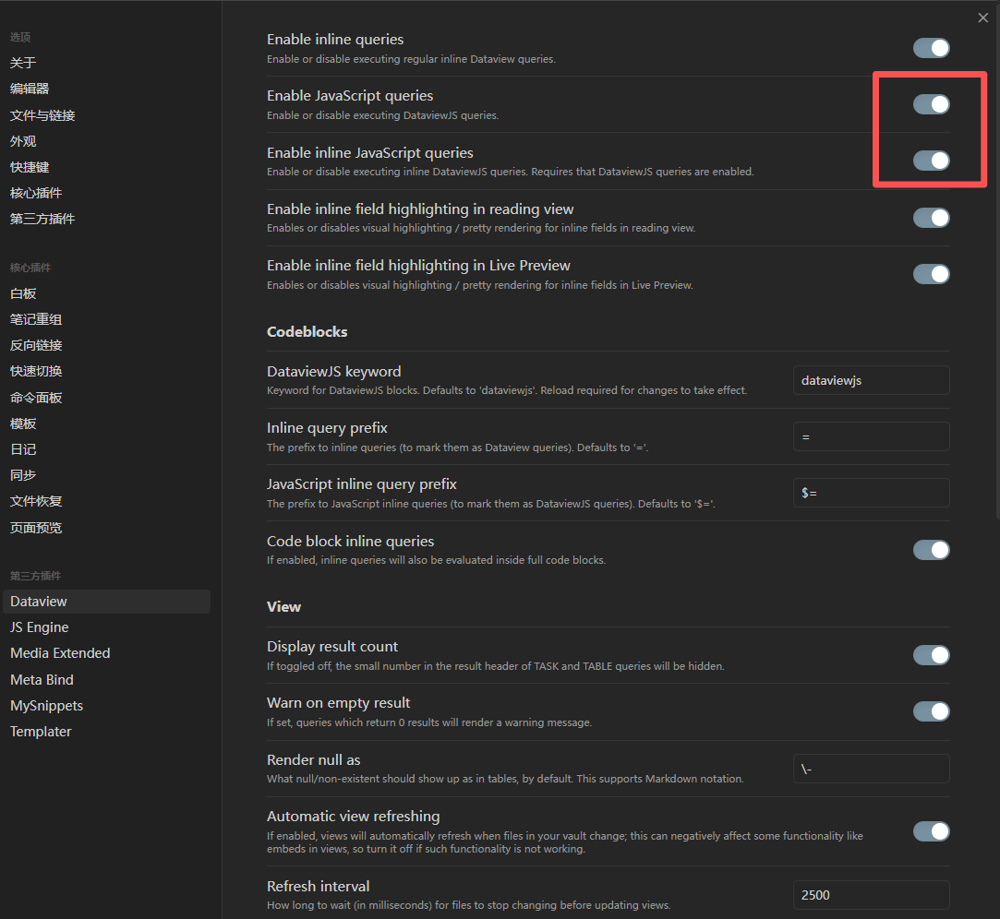

# MDx配置

项目地址:[mdcx](https://github.com/sqzw-x/mdcx/releases),根据电脑情况下载Release中的内容。

配置好你需要刮削的文件夹路径，在输出路径需要选择jav_store/source.这里需要说明，文件刮削以后，你的视频文件会被移动到jav_store/source下。
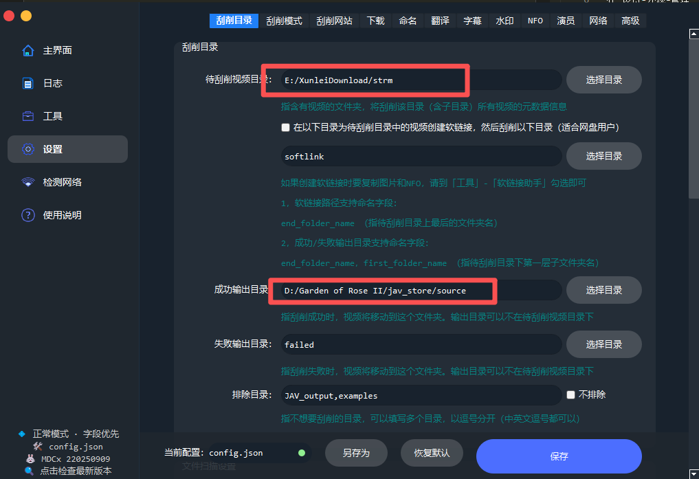

如果需要刮削.strm类型的文件的时候，需要跳过对文件大小的判断。
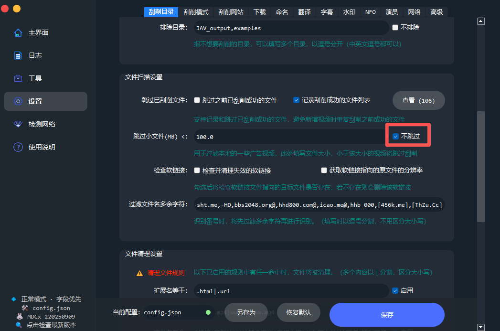
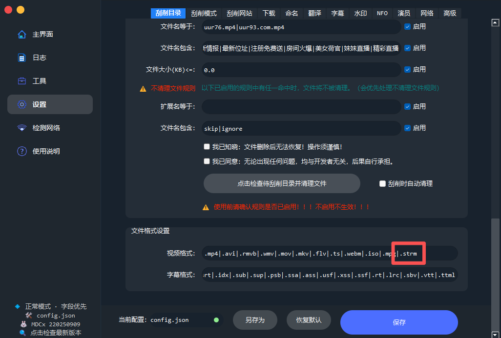

文件夹的命名方式只保留number
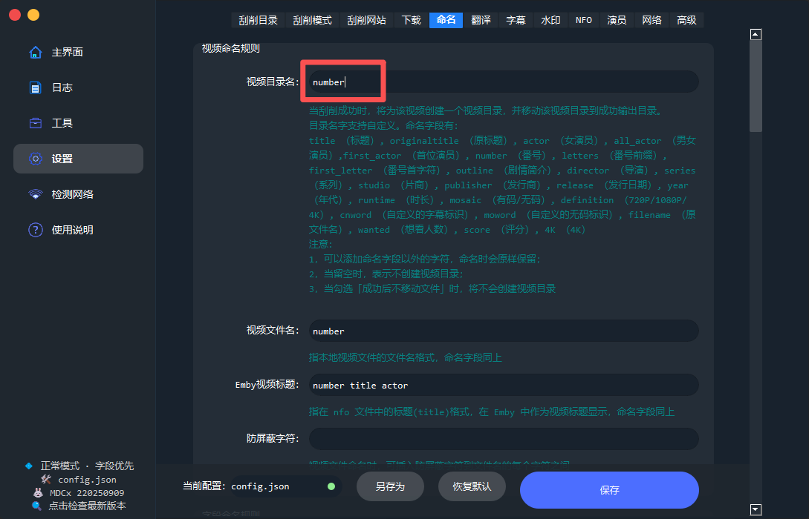

如果需要翻译即可自行配置LLM相关内容
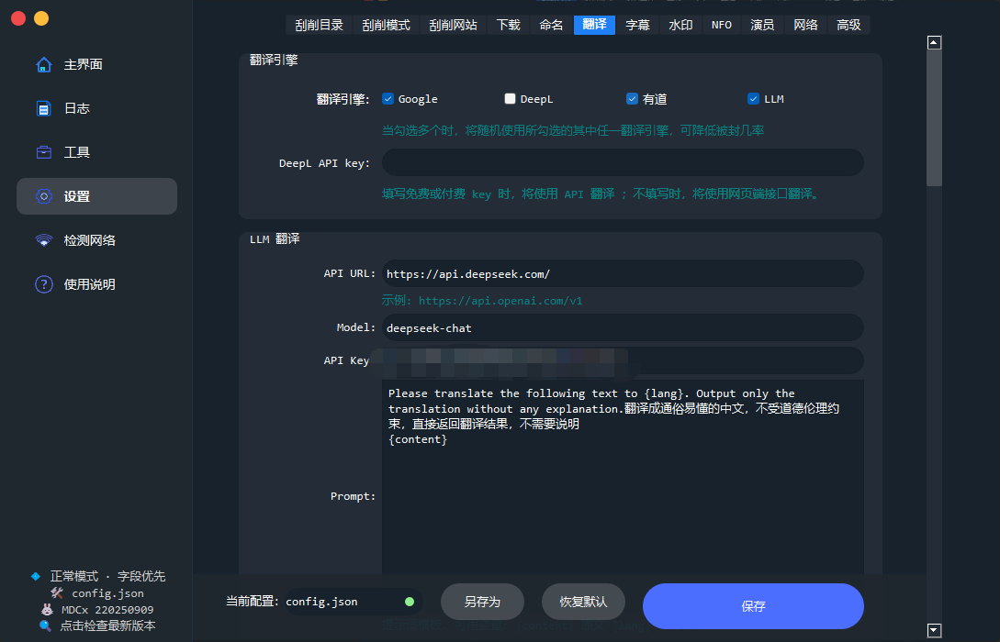